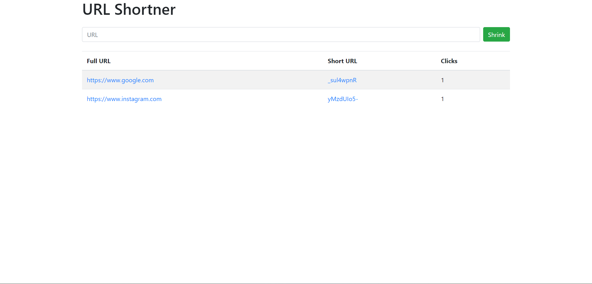

# URL Shortner

A URL shortener is a tool that condenses long web addresses into shorter, more manageable links for ease of sharing.

## Requirements

### Node

If the installation was successful, you should be able to run the following command.

    $ node --version
    v20.10.0

    $ npm --version
    10.2.3

If you need to update `npm`, you can make it using `npm`! Cool right? After running the following command, just open again the command line and be happy.

    $ npm install npm -g

---

## Install

    $ git clone https://github.com/harshjawla/url-shortner.git
    $ cd url-shortner
    $ npm install

## Running the project

    $ npm start

## Simple build for production

    $ npm build

## Screenshots

